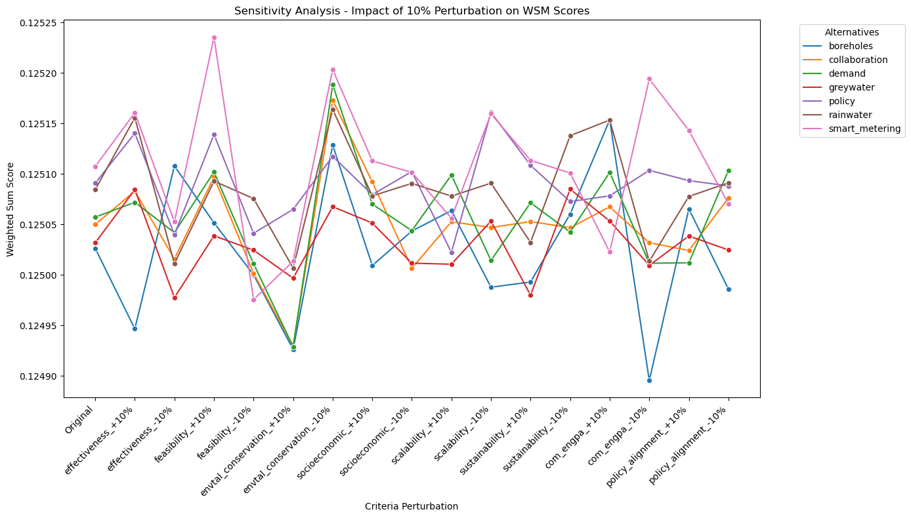
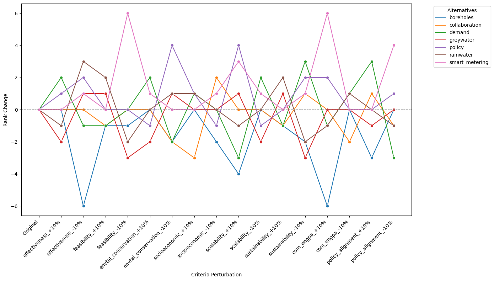

import pandas as pd
```


import os

os.chdir('Desktop/4.2/Urban Water Scarcity poject/DATA/DATA CLEANING/data')
```


# Load each CSV file into a separate DataFrame

import pandas as pd

additional = pd.read_csv('additional.csv')
boreholes = pd.read_csv('boreholes.csv')
collaboration = pd.read_csv('collaboration.csv')
criteria_evaluation = pd.read_csv('criteria_evaluation.csv')
demand = pd.read_csv('demand.csv')
# Read and view the csv file
demand = pd.read_csv('demand.csv')
expert_background = pd.read_csv('expert_background.csv')
greywater = pd.read_csv('greywater.csv')
policy = pd.read_csv('policy.csv')
rainwater = pd.read_csv('rainwater.csv')
scenario = pd.read_csv('scenario.csv')
smart_metering = pd.read_csv('smart_metering.csv')
uncertainty = pd.read_csv('uncertainty.csv')
```


# Calculate descriptive statistics and export to CSV

dataframes = {
    'boreholes': boreholes,
    'collaboration': collaboration,
    'criteria_evaluation': criteria_evaluation,
    'demand': demand,
    'greywater': greywater,
    'policy': policy,
    'rainwater': rainwater,
    'smart_metering': smart_metering
}

for name, df in dataframes.items():
    descriptive_stats = df.describe()
    descriptive_stats.to_csv(f"descriptive_stats_{name}.csv", index=True)

```


for name, df in dataframes.items():
    descriptive_stats = df.describe()
    print(f"Descriptive statistics for {name}:")
    print(descriptive_stats)
    print("\n" + "="*50 + "\n")
```

    Descriptive statistics for boreholes:
           effectiveness  feasibility  envtal_conservation  socioeconomic  \
    count      27.000000    27.000000            27.000000      27.000000   
    mean        3.814815     4.074074             3.740741       3.962963   
    std         1.272098     1.141050             1.022538       1.159625   
    min         1.000000     1.000000             1.000000       1.000000   
    25%         3.000000     3.500000             3.500000       3.500000   
    50%         4.000000     4.000000             4.000000       4.000000   
    75%         5.000000     5.000000             4.000000       5.000000   
    max         5.000000     5.000000             5.000000       5.000000   
    
           scalability  sustainability  com_engpa  policy_alignment  
    count    27.000000       27.000000  27.000000         27.000000  
    mean      4.111111        3.925926   4.333333          4.111111  
    std       1.120897        1.206582   0.919866          0.847319  
    min       2.000000        1.000000   2.000000          2.000000  
    25%       3.500000        4.000000   4.000000          4.000000  
    50%       5.000000        4.000000   5.000000          4.000000  
    75%       5.000000        5.000000   5.000000          5.000000  
    max       5.000000        5.000000   5.000000          5.000000  
    
    ==================================================
    
    Descriptive statistics for collaboration:
           effectiveness  feasibility  envtal_conservation  socioeconomic  \
    count      27.000000    27.000000            27.000000      27.000000   
    mean        4.111111     4.148148             3.703704       4.148148   
    std         0.933700     0.988538             1.067521       0.907393   
    min         2.000000     1.000000             1.000000       2.000000   
    25%         4.000000     4.000000             3.000000       4.000000   
    50%         4.000000     4.000000             4.000000       4.000000   
    75%         5.000000     5.000000             4.000000       5.000000   
    max         5.000000     5.000000             5.000000       5.000000   
    
           scalability  sustainability  com_engpa  policy_alignment  
    count    27.000000       27.000000  27.000000         27.000000  
    mean      4.037037        4.037037   4.074074          3.962963  
    std       1.018350        0.897924   0.957799          0.939782  
    min       2.000000        2.000000   2.000000          2.000000  
    25%       3.500000        4.000000   4.000000          3.000000  
    50%       4.000000        4.000000   4.000000          4.000000  
    75%       5.000000        5.000000   5.000000          5.000000  
    max       5.000000        5.000000   5.000000          5.000000  
    
    ==================================================
    
    Descriptive statistics for criteria_evaluation:
           effectiveness  feasibility  envtal_conservation  socioeconomic  \
    count      27.000000     27.00000            27.000000      27.000000   
    mean        4.481481      4.37037             4.074074       3.925926   
    std         0.848998      0.92604             0.957799       0.997147   
    min         2.000000      2.00000             1.000000       1.000000   
    25%         4.000000      4.00000             4.000000       3.500000   
    50%         5.000000      5.00000             4.000000       4.000000   
    75%         5.000000      5.00000             5.000000       5.000000   
    max         5.000000      5.00000             5.000000       5.000000   
    
           scalability  sustainability  com_engpa  policy_alignment  
    count    27.000000       27.000000  27.000000         27.000000  
    mean      4.074074        4.333333   4.333333          4.259259  
    std       0.828619        0.784465   0.832050          1.059484  
    min       2.000000        3.000000   2.000000          2.000000  
    25%       4.000000        4.000000   4.000000          4.000000  
    50%       4.000000        5.000000   5.000000          5.000000  
    75%       5.000000        5.000000   5.000000          5.000000  
    max       5.000000        5.000000   5.000000          5.000000  
    
    ==================================================
    
    Descriptive statistics for demand:
           effectiveness  feasibility  envtal_conservation  socioeconomic  \
    count      27.000000    27.000000            27.000000      27.000000   
    mean        3.925926     4.000000             3.555556       3.925926   
    std         1.035000     1.074172             1.219500       1.238048   
    min         1.000000     1.000000             1.000000       1.000000   
    25%         3.000000     4.000000             3.000000       4.000000   
    50%         4.000000     4.000000             4.000000       4.000000   
    75%         5.000000     5.000000             4.000000       5.000000   
    max         5.000000     5.000000             5.000000       5.000000   
    
           scalability  sustainability  com_engpa  policy_alignment  
    count      27.0000       27.000000       27.0         27.000000  
    mean        4.0000        3.925926        4.0          3.777778  
    std         1.1094        1.141050        1.0          1.250641  
    min         1.0000        1.000000        2.0          1.000000  
    25%         4.0000        3.000000        3.5          3.000000  
    50%         4.0000        4.000000        4.0          4.000000  
    75%         5.0000        5.000000        5.0          5.000000  
    max         5.0000        5.000000        5.0          5.000000  
    
    ==================================================
    
    Descriptive statistics for greywater:
           effectiveness  feasibility  envtal_conservation  socioeconomic  \
    count      27.000000    27.000000            27.000000      27.000000   
    mean        4.111111     4.000000             3.888889       4.037037   
    std         1.120897     1.037749             0.974022       0.897924   
    min         1.000000     1.000000             2.000000       2.000000   
    25%         4.000000     4.000000             3.000000       4.000000   
    50%         4.000000     4.000000             4.000000       4.000000   
    75%         5.000000     5.000000             5.000000       5.000000   
    max         5.000000     5.000000             5.000000       5.000000   
    
           scalability  sustainability  com_engpa  policy_alignment  
    count    27.000000       27.000000  27.000000         27.000000  
    mean      3.925926        3.851852   4.037037          4.000000  
    std       1.106829        0.948833   0.979854          1.037749  
    min       1.000000        1.000000   1.000000          1.000000  
    25%       3.000000        4.000000   4.000000          3.500000  
    50%       4.000000        4.000000   4.000000          4.000000  
    75%       5.000000        4.000000   5.000000          5.000000  
    max       5.000000        5.000000   5.000000          5.000000  
    
    ==================================================
    
    Descriptive statistics for policy:
           effectiveness  feasibility  envtal_conservation  socioeconomic  \
    count      27.000000      27.0000            27.000000      27.000000   
    mean        4.000000       4.0000             3.814815       3.851852   
    std         0.960769       1.1094             1.110684       1.099080   
    min         1.000000       1.0000             1.000000       1.000000   
    25%         4.000000       3.5000             3.500000       4.000000   
    50%         4.000000       4.0000             4.000000       4.000000   
    75%         5.000000       5.0000             4.500000       4.500000   
    max         5.000000       5.0000             5.000000       5.000000   
    
           scalability  sustainability  com_engpa  policy_alignment  
    count    27.000000       27.000000  27.000000         27.000000  
    mean      3.703704        3.925926   3.851852          3.888889  
    std       1.203035        0.997147   1.133534          0.933700  
    min       1.000000        1.000000   1.000000          1.000000  
    25%       3.000000        3.500000   3.000000          4.000000  
    50%       4.000000        4.000000   4.000000          4.000000  
    75%       5.000000        5.000000   5.000000          4.000000  
    max       5.000000        5.000000   5.000000          5.000000  
    
    ==================================================
    
    Descriptive statistics for rainwater:
           effectiveness  feasibility  envtal_conservation  socioeconomic  \
    count      27.000000    27.000000            27.000000      27.000000   
    mean        4.037037     3.888889             3.666667       3.851852   
    std         1.125969     0.933700             1.000000       0.948833   
    min         1.000000     2.000000             1.000000       1.000000   
    25%         3.000000     3.000000             3.500000       3.500000   
    50%         4.000000     4.000000             4.000000       4.000000   
    75%         5.000000     5.000000             4.000000       4.000000   
    max         5.000000     5.000000             5.000000       5.000000   
    
           scalability  sustainability  com_engpa  policy_alignment  
    count    27.000000       27.000000  27.000000         27.000000  
    mean      3.851852        3.740741   4.037037          3.851852  
    std       1.026709        1.258589   1.125969          1.133534  
    min       1.000000        1.000000   1.000000          1.000000  
    25%       3.500000        3.000000   3.500000          3.000000  
    50%       4.000000        4.000000   4.000000          4.000000  
    75%       4.500000        5.000000   5.000000          5.000000  
    max       5.000000        5.000000   5.000000          5.000000  
    
    ==================================================
    
    Descriptive statistics for smart_metering:
           effectiveness  feasibility  envtal_conservation  socioeconomic  \
    count      27.000000    27.000000            27.000000      27.000000   
    mean        4.000000     4.185185             3.629630       3.888889   
    std         0.960769     1.075498             1.213645       1.250641   
    min         1.000000     1.000000             1.000000       1.000000   
    25%         3.500000     4.000000             3.000000       3.000000   
    50%         4.000000     5.000000             4.000000       4.000000   
    75%         5.000000     5.000000             4.000000       5.000000   
    max         5.000000     5.000000             5.000000       5.000000   
    
           scalability  sustainability  com_engpa  policy_alignment  
    count    27.000000       27.000000  27.000000         27.000000  
    mean      3.740741        3.888889   3.666667          3.962963  
    std       1.227649        1.219500   1.300887          1.091276  
    min       1.000000        1.000000   1.000000          2.000000  
    25%       3.000000        3.500000   3.000000          3.000000  
    50%       4.000000        4.000000   4.000000          4.000000  
    75%       5.000000        5.000000   5.000000          5.000000  
    max       5.000000        5.000000   5.000000          5.000000  
    
    ==================================================
    
    


# Plot boxplots for each DataFrame with numeric columns

import seaborn as sns
import matplotlib.pyplot as plt

for name, df in dataframes.items():
    numeric_df = df.select_dtypes(include='number')  # Filter to only numeric columns
    if not numeric_df.empty:
        plt.figure(figsize=(10, 6))
        sns.boxplot(data=numeric_df)
        plt.title(f'Boxplot for {name}')
        plt.xticks(rotation=45)  # Rotate x-axis labels if necessary
        plt.tight_layout()  # Adjust layout to prevent overlap
        plt.show()
    else:
        print(f"No numeric data to plot for {name}")
```


    

    


    

    


    

    


    

    


    

    


    

    


    

    


    

    


# Convert columns to numeric if they contain numeric values stored as strings

import pandas as pd
import numpy as np

criteria_evaluation = criteria_evaluation.apply(pd.to_numeric, errors='coerce')

# Now calculate average scores for each criterion
criteria_averages = criteria_evaluation.mean()
print("Average scores for each criterion:\n", criteria_averages)

```

    Average scores for each criterion:
     responder_id                NaN
    effectiveness          4.481481
    feasibility            4.370370
    envtal_conservation    4.074074
    socioeconomic          3.925926
    scalability            4.074074
    sustainability         4.333333
    com_engpa              4.333333
    policy_alignment       4.259259
    dtype: float64
    


# Sum the averages to get the total average score
total_average = criteria_averages.sum()
print("\nTotal average score across all criteria:", total_average)
```

    
    Total average score across all criteria: 33.85185185185185
    


# Calculate normalized weights (weights should add up to 1)
criteria_weights = criteria_averages / total_average
print("\nNormalized weights for each criterion:\n", criteria_weights)
```

    
    Normalized weights for each criterion:
     responder_id                NaN
    effectiveness          0.132385
    feasibility            0.129103
    envtal_conservation    0.120350
    socioeconomic          0.115974
    scalability            0.120350
    sustainability         0.128009
    com_engpa              0.128009
    policy_alignment       0.125821
    dtype: float64
    


#TOTAL AVERAGE CALCULATION

import pandas as pd

# Load dataframes of interest
dataframes = {
    'boreholes': boreholes,
    'collaboration': collaboration,
    'demand': demand,
    'greywater': greywater,
    'policy': policy,
    'rainwater': rainwater,
    'smart_metering': smart_metering,
}

# Dictionary to store the averages for each alternative
alternatives_averages = {}

# Calculate the average for each column in each DataFrame
for name, df in dataframes.items():
    averages = df.mean(numeric_only=True)  # Calculate mean for each column
    alternatives_averages[name] = averages  # Store the result in the dictionary

# Print the averages for each alternative
for name, averages in alternatives_averages.items():
    print(f"Average scores for {name}:\n{averages}\n")
```

    Average scores for boreholes:
    effectiveness          3.814815
    feasibility            4.074074
    envtal_conservation    3.740741
    socioeconomic          3.962963
    scalability            4.111111
    sustainability         3.925926
    com_engpa              4.333333
    policy_alignment       4.111111
    dtype: float64
    
    Average scores for collaboration:
    effectiveness          4.111111
    feasibility            4.148148
    envtal_conservation    3.703704
    socioeconomic          4.148148
    scalability            4.037037
    sustainability         4.037037
    com_engpa              4.074074
    policy_alignment       3.962963
    dtype: float64
    
    Average scores for demand:
    effectiveness          3.925926
    feasibility            4.000000
    envtal_conservation    3.555556
    socioeconomic          3.925926
    scalability            4.000000
    sustainability         3.925926
    com_engpa              4.000000
    policy_alignment       3.777778
    dtype: float64
    
    Average scores for greywater:
    effectiveness          4.111111
    feasibility            4.000000
    envtal_conservation    3.888889
    socioeconomic          4.037037
    scalability            3.925926
    sustainability         3.851852
    com_engpa              4.037037
    policy_alignment       4.000000
    dtype: float64
    
    Average scores for policy:
    effectiveness          4.000000
    feasibility            4.000000
    envtal_conservation    3.814815
    socioeconomic          3.851852
    scalability            3.703704
    sustainability         3.925926
    com_engpa              3.851852
    policy_alignment       3.888889
    dtype: float64
    
    Average scores for rainwater:
    effectiveness          4.037037
    feasibility            3.888889
    envtal_conservation    3.666667
    socioeconomic          3.851852
    scalability            3.851852
    sustainability         3.740741
    com_engpa              4.037037
    policy_alignment       3.851852
    dtype: float64
    
    Average scores for smart_metering:
    effectiveness          4.000000
    feasibility            4.185185
    envtal_conservation    3.629630
    socioeconomic          3.888889
    scalability            3.740741
    sustainability         3.888889
    com_engpa              3.666667
    policy_alignment       3.962963
    dtype: float64
    
    


#NORMALIZATION OF AVERAGES

import pandas as pd

# Load dataframes of interest
dataframes = {
    'boreholes': boreholes,
    'collaboration': collaboration,
    'demand': demand,
    'greywater': greywater,
    'policy': policy,
    'rainwater': rainwater,
    'smart_metering': smart_metering,
}

# Dictionary to store the normalized averages for each alternative
normalized_averages = {}

# Calculate the average and normalize for each column in each DataFrame
for name, df in dataframes.items():
    averages = df.mean(numeric_only=True)  # Calculate mean for each column
    total_average = averages.sum()         # Calculate the total of averages
    
    # Normalize the averages so they sum up to 1
    if total_average != 0:                 # Avoid division by zero
        normalized = averages / total_average
    else:
        normalized = averages  # If total is zero, keep as it is (all zeros)

    # Store the normalized values in the dictionary
    normalized_averages[name] = normalized

# Print the normalized averages for each alternative
for name, normalized in normalized_averages.items():
    print(f"Normalized scores for {name}:\n{normalized}\n")

```

    Normalized scores for boreholes:
    effectiveness          0.118938
    feasibility            0.127021
    envtal_conservation    0.116628
    socioeconomic          0.123557
    scalability            0.128176
    sustainability         0.122402
    com_engpa              0.135104
    policy_alignment       0.128176
    dtype: float64
    
    Normalized scores for collaboration:
    effectiveness          0.127586
    feasibility            0.128736
    envtal_conservation    0.114943
    socioeconomic          0.128736
    scalability            0.125287
    sustainability         0.125287
    com_engpa              0.126437
    policy_alignment       0.122989
    dtype: float64
    
    Normalized scores for demand:
    effectiveness          0.126190
    feasibility            0.128571
    envtal_conservation    0.114286
    socioeconomic          0.126190
    scalability            0.128571
    sustainability         0.126190
    com_engpa              0.128571
    policy_alignment       0.121429
    dtype: float64
    
    Normalized scores for greywater:
    effectiveness          0.129070
    feasibility            0.125581
    envtal_conservation    0.122093
    socioeconomic          0.126744
    scalability            0.123256
    sustainability         0.120930
    com_engpa              0.126744
    policy_alignment       0.125581
    dtype: float64
    
    Normalized scores for policy:
    effectiveness          0.128878
    feasibility            0.128878
    envtal_conservation    0.122912
    socioeconomic          0.124105
    scalability            0.119332
    sustainability         0.126492
    com_engpa              0.124105
    policy_alignment       0.125298
    dtype: float64
    
    Normalized scores for rainwater:
    effectiveness          0.130539
    feasibility            0.125749
    envtal_conservation    0.118563
    socioeconomic          0.124551
    scalability            0.124551
    sustainability         0.120958
    com_engpa              0.130539
    policy_alignment       0.124551
    dtype: float64
    
    Normalized scores for smart_metering:
    effectiveness          0.129187
    feasibility            0.135167
    envtal_conservation    0.117225
    socioeconomic          0.125598
    scalability            0.120813
    sustainability         0.125598
    com_engpa              0.118421
    policy_alignment       0.127990
    dtype: float64
    
    


import pandas as pd
from pingouin import cronbach_alpha

# Load the data
df = pd.read_csv("criteria_evaluation.csv")

# Select the relevant columns for the reliability test
columns_for_cronbach_alpha = [
    "effectiveness",
    "feasibility",
    "envtal_conservation",
    "socioeconomic",
    "scalability",
    "sustainability",
    "com_engpa",
    "policy_alignment",
]

# Filter the DataFrame to include only rows with non-null values
df_filtered = df.dropna(subset=columns_for_cronbach_alpha)

# Convert the columns to numeric
df_filtered[columns_for_cronbach_alpha] = df_filtered[
    columns_for_cronbach_alpha
].apply(pd.to_numeric, errors="coerce")

# Calculate Cronbach's alpha
cronbach_alpha_result = cronbach_alpha(data=df_filtered[columns_for_cronbach_alpha])

# Print Cronbach's alpha
print(f"Cronbach's alpha: {cronbach_alpha_result[0]}")
```

    Cronbach's alpha: 0.8929009310033548
    


# Ranking of Alternatives based on WSM:

import pandas as pd

# Step 1: Define normalized weights for each criterion based on your provided data
criteria_weights = pd.Series({
    'effectiveness': 0.132385,
    'feasibility': 0.129103,
    'envtal_conservation': 0.120350,
    'socioeconomic': 0.115974,
    'scalability': 0.120350,
    'sustainability': 0.128009,
    'com_engpa': 0.128009,
    'policy_alignment': 0.125821
})

# Step 2: Define weights for each alternative based on provided weights
alternative_weights = {
    'boreholes': pd.Series({
        'effectiveness': 0.118938,
        'feasibility': 0.127021,
        'envtal_conservation': 0.116628,
        'socioeconomic': 0.123557,
        'scalability': 0.128176,
        'sustainability': 0.122402,
        'com_engpa': 0.135104,
        'policy_alignment': 0.128176
    }),
    'collaboration': pd.Series({
        'effectiveness': 0.127586,
        'feasibility': 0.128736,
        'envtal_conservation': 0.114943,
        'socioeconomic': 0.128736,
        'scalability': 0.125287,
        'sustainability': 0.125287,
        'com_engpa': 0.126437,
        'policy_alignment': 0.122989
    }),
    'demand': pd.Series({
        'effectiveness': 0.143631,
        'feasibility': 0.146341,
        'envtal_conservation': 0.130081,
        'socioeconomic': 0.143631,
        'scalability': 0.146341,
        'sustainability': 0.143631,
        'com_engpa': 0.146341,
        'policy_alignment': 0
    }),
    'greywater': pd.Series({
        'effectiveness': 0.129070,
        'feasibility': 0.125581,
        'envtal_conservation': 0.122093,
        'socioeconomic': 0.126744,
        'scalability': 0.123256,
        'sustainability': 0.120930,
        'com_engpa': 0.126744,
        'policy_alignment': 0.125581
    }),
    'policy': pd.Series({
        'effectiveness': 0.128878,
        'feasibility': 0.128878,
        'envtal_conservation': 0.122912,
        'socioeconomic': 0.124105,
        'scalability': 0.119332,
        'sustainability': 0.126492,
        'com_engpa': 0.124105,
        'policy_alignment': 0.125298
    }),
    'rainwater': pd.Series({
        'effectiveness': 0.130539,
        'feasibility': 0.125749,
        'envtal_conservation': 0.118563,
        'socioeconomic': 0.124551,
        'scalability': 0.124551,
        'sustainability': 0.120958,
        'com_engpa': 0.130539,
        'policy_alignment': 0.124551
    }),
    'smart_metering': pd.Series({
        'effectiveness': 0.129187,
        'feasibility': 0.135167,
        'envtal_conservation': 0.117225,
        'socioeconomic': 0.125598,
        'scalability': 0.120813,
        'sustainability': 0.125598,
        'com_engpa': 0.118421,
        'policy_alignment': 0.127990
    })
}

# Step 3: Calculate the weighted sum score for each alternative
final_scores = {alt_name: round((alt_weights * criteria_weights).sum(), 6) 
                for alt_name, alt_weights in alternative_weights.items()}

# Step 4: Convert the final scores to a pandas Series and rank them
ranked_alternatives = pd.Series(final_scores).sort_values(ascending=False)

# Display the ranked alternatives
print("Final Ranking of Alternatives based on WSM:\n", ranked_alternatives)
```

    Final Ranking of Alternatives based on WSM:
     smart_metering    0.125107
    policy            0.125091
    rainwater         0.125084
    collaboration     0.125050
    greywater         0.125032
    boreholes         0.125026
    demand            0.124952
    dtype: float64
    


#RANKINGS BAR CHART

import pandas as pd
import matplotlib.pyplot as plt

# Visualize the ranking using a horizontal bar graph
plt.figure(figsize=(10, 6))
plt.barh(ranked_alternatives.index, ranked_alternatives.values)
plt.xlabel('Weighted Sum Score')
plt.ylabel('Alternatives')
plt.title('Final Ranking of Alternatives based on WSM')
plt.gca().invert_yaxis()  # Invert y-axis to show highest rank at the top
plt.xlim(0.124, 0.126) 
plt.show()
```


    

    


import pingouin as pg
import pandas as pd
from factor_analyzer import FactorAnalyzer
from semopy import Model

# Load your CSV data
try:
    df = pd.read_csv('criteria_evaluation.csv')
except FileNotFoundError:
    print("File not found. Please check the path.")
    exit()

# Drop responder_id or other non-relevant columns
df = df.iloc[:, 1:]

# ------------------------ 1. Cronbach's Alpha ------------------------ #
# Calculate Cronbach's Alpha to assess internal consistency
alpha, _ = pg.cronbach_alpha(data=df)
print(f"Cronbach's Alpha: {alpha}")

# ----------------- 2. Exploratory Factor Analysis (EFA) ---------------- #
# Initialize FactorAnalyzer with the number of factors
fa = FactorAnalyzer(n_factors=1)  # Removed rotation since n_factors=1
fa.fit(df)

# Get factor loadings from the EFA
loadings = fa.loadings_
print("\nExploratory Factor Analysis (EFA) - Factor Loadings:")
print(loadings)

# -------------------- 3. Composite Reliability (CR) -------------------- #
# Define a measurement model for Confirmatory Factor Analysis (CFA)
criteria_columns = df.columns.tolist()  # Dynamically retrieve column names
model_desc = "latent_variable =~ " + " + ".join(criteria_columns)

# Create and fit the SEM model using semopy
model = Model(model_desc)
model.fit(df)

# Inspect the model to see available outputs
model_output = model.inspect()
print("\nModel Output:")
print(model_output)

# Check if 'loadings' and 'variances' are available and calculate Composite Reliability (CR)
if 'loadings' in model_output and 'variances' in model_output:
    loadings = model_output['loadings']
    variances = model_output['variances']

    # Calculate Composite Reliability (CR)
    composite_reliability = (loadings.sum() ** 2) / ((loadings.sum() ** 2) + variances.sum())
    print(f"\nComposite Reliability (CR): {composite_reliability}")
else:
    print("The required keys 'loadings' and 'variances' are not present in the model output.")
```

    Cronbach's Alpha: 0.8929009310033548
    
    Exploratory Factor Analysis (EFA) - Factor Loadings:
    [[-0.78731544]
     [-0.82442367]
     [-0.46051106]
     [-0.6230063 ]
     [-0.62414011]
     [-0.80449769]
     [-0.77082524]
     [-0.87551632]]
    
    Model Output:
                       lval  op                 rval  Estimate  Std. Err  \
    0         effectiveness   ~      latent_variable  1.000000         -   
    1           feasibility   ~      latent_variable  1.122077  0.264402   
    2   envtal_conservation   ~      latent_variable  0.708400  0.287829   
    3         socioeconomic   ~      latent_variable  0.974326  0.293049   
    4           scalability   ~      latent_variable  0.719457  0.246275   
    5        sustainability   ~      latent_variable  1.051603   0.22006   
    6             com_engpa   ~      latent_variable  0.952083  0.239706   
    7      policy_alignment   ~      latent_variable  1.492706  0.295367   
    8       latent_variable  ~~      latent_variable  0.400972  0.175823   
    9             com_engpa  ~~            com_engpa  0.303209  0.090869   
    10        effectiveness  ~~        effectiveness  0.293264  0.089185   
    11  envtal_conservation  ~~  envtal_conservation  0.682097  0.189876   
    12          feasibility  ~~          feasibility  0.320985  0.099416   
    13     policy_alignment  ~~     policy_alignment  0.187500  0.081097   
    14          scalability  ~~          scalability  0.453788  0.127938   
    15        socioeconomic  ~~        socioeconomic  0.576780  0.165266   
    16       sustainability  ~~       sustainability  0.149165  0.053036   
    
         z-value   p-value  
    0          -         -  
    1   4.243823  0.000022  
    2   2.461184  0.013848  
    3   3.324794  0.000885  
    4   2.921353  0.003485  
    5   4.778706  0.000002  
    6   3.971874  0.000071  
    7   5.053737       0.0  
    8   2.280544  0.022575  
    9   3.336751  0.000848  
    10  3.288247  0.001008  
    11  3.592325  0.000328  
    12  3.228721  0.001243  
    13  2.312053  0.020775  
    14  3.546939   0.00039  
    15  3.489997  0.000483  
    16  2.812523  0.004915  
    The required keys 'loadings' and 'variances' are not present in the model output.
    

    C:\Users\Elsaiden\anaconda3\envs\MCDMWaterStrategies\Lib\site-packages\factor_analyzer\factor_analyzer.py:663: UserWarning: No rotation will be performed when the number of factors equals 1.
      warnings.warn(
    


import pandas as pd
import numpy as np
import matplotlib.pyplot as plt

# Step 1: Define the criteria weights (based on normalized values provided)
criteria_weights = pd.Series({
    'effectiveness': 0.132385,
    'feasibility': 0.129103,
    'envtal_conservation': 0.120350,
    'socioeconomic': 0.115974,
    'scalability': 0.120350,
    'sustainability': 0.128009,
    'com_engpa': 0.128009,
    'policy_alignment': 0.125821
})

# Step 2: Define the decision matrix with alternatives (based on your provided weights)
decision_matrix = pd.DataFrame({
    'effectiveness': [0.118938, 0.127586, 0.143631, 0.129070, 0.128878, 0.130539, 0.129187],
    'feasibility': [0.127021, 0.128736, 0.146341, 0.125581, 0.128878, 0.125749, 0.135167],
    'envtal_conservation': [0.116628, 0.114943, 0.130081, 0.122093, 0.122912, 0.118563, 0.117225],
    'socioeconomic': [0.123557, 0.128736, 0.143631, 0.126744, 0.124105, 0.124551, 0.125598],
    'scalability': [0.128176, 0.125287, 0.146341, 0.123256, 0.119332, 0.124551, 0.120813],
    'sustainability': [0.122402, 0.125287, 0.143631, 0.120930, 0.126492, 0.120958, 0.125598],
    'com_engpa': [0.135104, 0.126437, 0.146341, 0.126744, 0.124105, 0.130539, 0.118421],
    'policy_alignment': [0.128176, 0.122989, 0.000000, 0.125581, 0.125298, 0.124551, 0.127990]
}, index=['boreholes', 'collaboration', 'demand', 'greywater', 'policy', 'rainwater', 'smart_metering'])

# Step 3: Normalize the decision matrix
normalized_matrix = decision_matrix / np.sqrt((decision_matrix**2).sum())

# Step 4: Calculate the weighted normalized decision matrix
weighted_matrix = normalized_matrix * criteria_weights

# Step 5: Determine the ideal (best) and anti-ideal (worst) solutions
ideal_solution = weighted_matrix.max()  # Best values (assuming all criteria are benefit criteria)
anti_ideal_solution = weighted_matrix.min()  # Worst values

# Step 6: Calculate the Euclidean distance from the ideal and anti-ideal solutions for each alternative
dist_to_ideal = np.sqrt(((weighted_matrix - ideal_solution)**2).sum(axis=1))
dist_to_anti_ideal = np.sqrt(((weighted_matrix - anti_ideal_solution)**2).sum(axis=1))

# Step 7: Calculate the relative closeness to the ideal solution
relative_closeness = dist_to_anti_ideal / (dist_to_ideal + dist_to_anti_ideal)

# Step 8: Rank alternatives based on relative closeness
ranked_alternatives_topsis = relative_closeness.sort_values(ascending=False)

# Display the ranked alternatives
print("Final Ranking of Alternatives based on TOPSIS:\n", ranked_alternatives_topsis)

# Visualize the ranking using a horizontal bar graph
plt.figure(figsize=(10, 6))
plt.barh(ranked_alternatives_topsis.index, ranked_alternatives_topsis.values, color='skyblue')
plt.xlabel('Relative Closeness to Ideal Solution')
plt.ylabel('Alternatives')
plt.title('Final Ranking of Alternatives based on TOPSIS')
plt.gca().invert_yaxis()  # Invert y-axis to show highest rank at the top
plt.xlim(0.2, 0.75) 
plt.show()

```

    Final Ranking of Alternatives based on TOPSIS:
     collaboration     0.743227
    rainwater         0.742078
    boreholes         0.741096
    greywater         0.739365
    policy            0.738524
    smart_metering    0.737929
    demand            0.300671
    dtype: float64
    


    

    


#WORDCLOUD 1

import pandas as pd
import matplotlib.pyplot as plt
from wordcloud import WordCloud

# Load the data from additional.csv
df = pd.read_csv('additional.csv')

# Remove entries with NaN in the 'areas_of_improvement' column
df = df.dropna(subset=['recommended_strategy'])

# Extract the text data from the causes_of_waterscarcity column
all_responses = ' '.join(df['recommended_strategy'].astype(str).tolist())

# Generate the word cloud
wordcloud = WordCloud(width=800, height=400, background_color='white').generate(all_responses)

# Display the word cloud
plt.figure(figsize=(10, 5))
plt.imshow(wordcloud, interpolation='bilinear')
plt.axis('off')
plt.show()
```


    

    


#wordcloud 2

import pandas as pd
import matplotlib.pyplot as plt
from wordcloud import WordCloud

# Load the data from additional.csv
df = pd.read_csv('additional.csv')

# Remove entries with NaN in the 'areas_of_improvement' column
df = df.dropna(subset=['areas_of_improvement'])

# Extract the text data from the areas_of_improvement column
all_responses = ' '.join(df['areas_of_improvement'].astype(str).tolist())

# Generate the word cloud
wordcloud = WordCloud(width=800, height=400, background_color='white').generate(all_responses)

# Display the word cloud
plt.figure(figsize=(10, 5))
plt.imshow(wordcloud, interpolation='bilinear')
plt.axis('off')
plt.show()
```


    

    


# THEMATIC ANALYSIS

import pandas as pd

# Define a function to categorize each entry into themes
def categorize_entry(entry):
    themes = {
        "Infrastructure Upgrades": ["infrastructure", "leaks", "repair", "upgrade", "rehabilitation"],
        "Water Conservation and Efficiency": ["water-saving", "inefficient use", "consumption", "efficiency"],
        "Wastewater Management": ["wastewater treatment", "purification", "effluent"],
        "Water Governance and Policy": ["governance", "regulations", "accountability", "community participation"],
        "Resource Management": ["wetland management", "underground water", "new dam", "water bodies"],
        "Technological Integration": ["geospatial", "data collection"]
    }
    
    # Categorize the entry based on keywords
    entry_themes = []
    for theme, keywords in themes.items():
        if any(keyword in entry.lower() for keyword in keywords):
            entry_themes.append(theme)
    return entry_themes

# Apply the categorization function to each entry
df['themes'] = df['areas_of_improvement'].apply(categorize_entry)

# Count occurrences of each theme
theme_counts = {}
for themes_list in df['themes']:
    for theme in themes_list:
        if theme in theme_counts:
            theme_counts[theme] += 1
        else:
            theme_counts[theme] = 1

# Display the theme counts
print("Theme Counts:\n", theme_counts)

# Summarize entries by theme
for theme in theme_counts.keys():
    print(f"\nTheme: {theme}")
    print(df[df['themes'].apply(lambda x: theme in x)]['areas_of_improvement'].tolist())
```

    Theme Counts:
     {'Infrastructure Upgrades': 16, 'Technological Integration': 8, 'Water Conservation and Efficiency': 9, 'Resource Management': 35, 'Wastewater Management': 22, 'Water Governance and Policy': 2}
    
    Theme: Infrastructure Upgrades
    ["he city's water infrastructure is outdated and prone to leaks, leading to significant water losses. A comprehensive upgrade and rehabilitation program is essential.", 'Repair & upgrade of Infrastructure ', 'Underground water based infrastructure ', "There's a lack of reliable data and information on water resources, consumption patterns, and infrastructure conditions. Improved data collection and management systems are needed for informed decision-making.", 'Repair & upgrade of Infrastructure ', 'Underground water based infrastructure ', 'Repair & upgrade of Infrastructure ', 'Underground water based infrastructure ', 'Repair & upgrade of Infrastructure ', 'Underground water based infrastructure ', 'Repair & upgrade of Infrastructure ', 'Underground water based infrastructure ', 'Repair & upgrade of Infrastructure ', 'Underground water based infrastructure ', 'Repair & upgrade of Infrastructure ', 'Underground water based infrastructure ']
    
    Theme: Technological Integration
    ['application of geospatial technologies', "There's a lack of reliable data and information on water resources, consumption patterns, and infrastructure conditions. Improved data collection and management systems are needed for informed decision-making.", 'application of geospatial technologies', 'application of geospatial technologies', 'application of geospatial technologies', 'application of geospatial technologies', 'application of geospatial technologies', 'application of geospatial technologies']
    
    Theme: Water Conservation and Efficiency
    ['A deeper level of analysis on the current water consumption rates and underground water reserves is necessary', 'Water is often used inefficiently in agriculture, industry, and households. Promoting water-saving technologies and practices is essential.', "There's a lack of reliable data and information on water resources, consumption patterns, and infrastructure conditions. Improved data collection and management systems are needed for informed decision-making.", 'A deeper level of analysis on the current water consumption rates and underground water reserves is necessary', 'A deeper level of analysis on the current water consumption rates and underground water reserves is necessary', 'A deeper level of analysis on the current water consumption rates and underground water reserves is necessary', 'A deeper level of analysis on the current water consumption rates and underground water reserves is necessary', 'A deeper level of analysis on the current water consumption rates and underground water reserves is necessary', 'A deeper level of analysis on the current water consumption rates and underground water reserves is necessary']
    
    Theme: Resource Management
    ['A deeper level of analysis on the current water consumption rates and underground water reserves is necessary', 'Wetland management ', 'need for a new dam adjacent to Chitungwiza', 'need for more water bodies around Chitungwiza. ', 'Underground water based infrastructure ', 'A deeper level of analysis on the current water consumption rates and underground water reserves is necessary', 'Wetland management ', 'need for a new dam adjacent to Chitungwiza', 'need for more water bodies around Chitungwiza. ', 'Underground water based infrastructure ', 'A deeper level of analysis on the current water consumption rates and underground water reserves is necessary', 'Wetland management ', 'need for a new dam adjacent to Chitungwiza', 'need for more water bodies around Chitungwiza. ', 'Underground water based infrastructure ', 'A deeper level of analysis on the current water consumption rates and underground water reserves is necessary', 'Wetland management ', 'need for a new dam adjacent to Chitungwiza', 'need for more water bodies around Chitungwiza. ', 'Underground water based infrastructure ', 'A deeper level of analysis on the current water consumption rates and underground water reserves is necessary', 'Wetland management ', 'need for a new dam adjacent to Chitungwiza', 'need for more water bodies around Chitungwiza. ', 'Underground water based infrastructure ', 'A deeper level of analysis on the current water consumption rates and underground water reserves is necessary', 'Wetland management ', 'need for a new dam adjacent to Chitungwiza', 'need for more water bodies around Chitungwiza. ', 'Underground water based infrastructure ', 'A deeper level of analysis on the current water consumption rates and underground water reserves is necessary', 'Wetland management ', 'need for a new dam adjacent to Chitungwiza', 'need for more water bodies around Chitungwiza. ', 'Underground water based infrastructure ']
    
    Theme: Wastewater Management
    ['Proper wastewater treatment ', 'Council Water purification ', 'Purification ', "Harare's wastewater treatment facilities are insufficient and often overloaded, resulting in untreated or partially treated effluent polluting water sources. Upgrading and expanding these facilities is crucial.", 'Proper wastewater treatment ', 'Council Water purification ', 'Purification ', 'Proper wastewater treatment ', 'Council Water purification ', 'Purification ', 'Proper wastewater treatment ', 'Council Water purification ', 'Purification ', 'Proper wastewater treatment ', 'Council Water purification ', 'Purification ', 'Proper wastewater treatment ', 'Council Water purification ', 'Purification ', 'Proper wastewater treatment ', 'Council Water purification ', 'Purification ']
    
    Theme: Water Governance and Policy
    ["There's a need for stronger water governance frameworks, including transparent and accountable institutions, clear regulations, and effective enforcement mechanisms.", 'Community participation in water management decisions is often lacking. Greater efforts are needed to involve residents in planning, implementation, and monitoring of water projects.']
    


#THEME COUNTS VISUALIZATION

import pandas as pd
import matplotlib.pyplot as plt
import seaborn as sns
from wordcloud import WordCloud

# 1. Bar Chart of Theme Counts
theme_counts = {
    'Technological Integration': 7, 
    'Water Conservation and Efficiency': 7, 
    'Resource Management': 28, 
    'Wastewater Management': 21, 
    'Infrastructure Upgrades': 7
}

# Bar Chart of Theme Counts
plt.figure(figsize=(10, 6))
sns.barplot(x=list(theme_counts.keys()), y=list(theme_counts.values()), palette="viridis")
plt.title("Theme Counts")
plt.xlabel("Themes")
plt.ylabel("Count")
plt.xticks(rotation=45, ha="right")
plt.tight_layout()
plt.show()

plt.tight_layout()
plt.show()

```

    C:\Users\Elsaiden\AppData\Local\Temp\ipykernel_14880\2279356359.py:19: FutureWarning: 
    
    Passing `palette` without assigning `hue` is deprecated and will be removed in v0.14.0. Assign the `x` variable to `hue` and set `legend=False` for the same effect.
    
      sns.barplot(x=list(theme_counts.keys()), y=list(theme_counts.values()), palette="viridis")
    


    

    


    <Figure size 640x480 with 0 Axes>


# Criteria Sensitivity Analysis

import pandas as pd
import numpy as np
import seaborn as sns
import matplotlib.pyplot as plt

# --- Data ---
criteria_weights = pd.Series({
    'effectiveness': 0.132385,
    'feasibility': 0.129103,
    'envtal_conservation': 0.120350,
    'socioeconomic': 0.115974,
    'scalability': 0.120350,
    'sustainability': 0.128009,
    'com_engpa': 0.128009,
    'policy_alignment': 0.125821
})

alternative_weights = {
    'boreholes': pd.Series({
        'effectiveness': 0.118938,
        'feasibility': 0.127021,
        'envtal_conservation': 0.116628,
        'socioeconomic': 0.123557,
        'scalability': 0.128176,
        'sustainability': 0.122402,
        'com_engpa': 0.135104,
        'policy_alignment': 0.128176
    }),
    'collaboration': pd.Series({
        'effectiveness': 0.127586,
        'feasibility': 0.128736,
        'envtal_conservation': 0.114943,
        'socioeconomic': 0.128736,
        'scalability': 0.125287,
        'sustainability': 0.125287,
        'com_engpa': 0.126437,
        'policy_alignment': 0.122989
    }),
    'demand': pd.Series({
        'effectiveness': 0.126190,
        'feasibility': 0.128571,
        'envtal_conservation': 0.114286,
        'socioeconomic': 0.126190,
        'scalability': 0.128571,
        'sustainability': 0.126190,
        'com_engpa': 0.128571,
        'policy_alignment': 0.121429
    }),
    'greywater': pd.Series({
        'effectiveness': 0.129070,
        'feasibility': 0.125581,
        'envtal_conservation': 0.122093,
        'socioeconomic': 0.126744,
        'scalability': 0.123256,
        'sustainability': 0.120930,
        'com_engpa': 0.126744,
        'policy_alignment': 0.125581
    }),
    'policy': pd.Series({
        'effectiveness': 0.128878,
        'feasibility': 0.128878,
        'envtal_conservation': 0.122912,
        'socioeconomic': 0.124105,
        'scalability': 0.119332,
        'sustainability': 0.126492,
        'com_engpa': 0.124105,
        'policy_alignment': 0.125298
    }),
    'rainwater': pd.Series({
        'effectiveness': 0.130539,
        'feasibility': 0.125749,
        'envtal_conservation': 0.118563,
        'socioeconomic': 0.124551,
        'scalability': 0.124551,
        'sustainability': 0.120958,
        'com_engpa': 0.130539,
        'policy_alignment': 0.124551
    }),
    'smart_metering': pd.Series({
        'effectiveness': 0.129187,
        'feasibility': 0.135167,
        'envtal_conservation': 0.117225,
        'socioeconomic': 0.125598,
        'scalability': 0.120813,
        'sustainability': 0.125598,
        'com_engpa': 0.118421,
        'policy_alignment': 0.127990
    })
}

# --- Functions ---
def calculate_wsm_scores(alt_weights, criteria_weights):
    """Calculates WSM scores given alternative and criteria weights."""
    final_scores = {}
    for alt_name, alt_w in alt_weights.items():
        total_score = (alt_w * criteria_weights).sum()
        final_scores[alt_name] = total_score
    return pd.Series(final_scores)

# Calculate the original scores
original_scores = calculate_wsm_scores(alternative_weights, criteria_weights)

# Sensitivity Analysis with 10% Perturbation
perturbation_factor = 0.1  # 10% perturbation
sensitivity_results = {'Original': original_scores}

for criterion in criteria_weights.index:
    # Increase weight by 10%
    increased_weights = criteria_weights.copy()
    increased_weights[criterion] *= (1 + perturbation_factor)
    increased_weights /= increased_weights.sum()  # Normalize to keep sum = 1
    increased_scores = calculate_wsm_scores(alternative_weights, increased_weights)
    sensitivity_results[f'{criterion}_+10%'] = increased_scores

    # Decrease weight by 10%
    decreased_weights = criteria_weights.copy()
    decreased_weights[criterion] *= (1 - perturbation_factor)
    decreased_weights /= decreased_weights.sum()  # Normalize to keep sum = 1
    decreased_scores = calculate_wsm_scores(alternative_weights, decreased_weights)
    sensitivity_results[f'{criterion}_-10%'] = decreased_scores

# Combine results into a DataFrame for easy plotting
sensitivity_df = pd.DataFrame(sensitivity_results)

# --- Plotting ---
# Melt the DataFrame for seaborn plotting
melted_df = sensitivity_df.reset_index().melt(id_vars='index', var_name='Perturbation', value_name='Score')

# Line Plot
plt.figure(figsize=(14, 8))
sns.lineplot(x='Perturbation', y='Score', hue='index', data=melted_df, marker='o')
plt.xticks(rotation=45, ha='right')
plt.ylabel('Weighted Sum Score')
plt.xlabel('Criteria Perturbation')
plt.title('Sensitivity Analysis - Impact of 10% Perturbation on WSM Scores')
plt.legend(title='Alternatives', bbox_to_anchor=(1.05, 1), loc='upper left')
plt.tight_layout()
plt.show()

# --- Recalculate Rankings ---
def calculate_rankings(scores_df):
    """Converts scores into rankings (lower rank = higher preference)."""
    return scores_df.rank(ascending=False, axis=0, method='min')

# Calculate rankings for original and perturbed scores
rankings_df = calculate_rankings(sensitivity_df)

# --- Calculate Rank Changes ---
# Calculate rank differences from the original rankings
rank_changes = rankings_df.sub(rankings_df['Original'], axis=0)

# --- Plot the Effects of Perturbation ---
# Prepare melted DataFrame for plotting rank shifts
rank_melted_df = rank_changes.reset_index().melt(
    id_vars='index', var_name='Perturbation', value_name='Rank Change'
)

# Line Plot of Rank Changes
plt.figure(figsize=(14, 8))
sns.lineplot(x='Perturbation', y='Rank Change', hue='index', data=rank_melted_df, marker='o')
plt.axhline(0, color='gray', linestyle='--', linewidth=1)  # Baseline for no rank change
plt.xticks(rotation=45, ha='right')
plt.ylabel('Rank Change')
plt.xlabel('Criteria Perturbation')
plt.title('Sensitivity Analysis - Rank Changes due to Perturbation')
plt.legend(title='Alternatives', bbox_to_anchor=(1.05, 1), loc='upper left')
plt.tight_layout()
plt.show()

# --- Summarize Results ---
print("=== WSM Rankings Before and After Perturbation ===")
print(rankings_df)

print("\n=== Rank Changes Due to Perturbation ===")
print(rank_changes)

```

    C:\Users\Elsaiden\anaconda3\Lib\site-packages\seaborn\_oldcore.py:1119: FutureWarning: use_inf_as_na option is deprecated and will be removed in a future version. Convert inf values to NaN before operating instead.
      with pd.option_context('mode.use_inf_as_na', True):
    C:\Users\Elsaiden\anaconda3\Lib\site-packages\seaborn\_oldcore.py:1119: FutureWarning: use_inf_as_na option is deprecated and will be removed in a future version. Convert inf values to NaN before operating instead.
      with pd.option_context('mode.use_inf_as_na', True):
    


    

    


    C:\Users\Elsaiden\anaconda3\Lib\site-packages\seaborn\_oldcore.py:1119: FutureWarning: use_inf_as_na option is deprecated and will be removed in a future version. Convert inf values to NaN before operating instead.
      with pd.option_context('mode.use_inf_as_na', True):
    C:\Users\Elsaiden\anaconda3\Lib\site-packages\seaborn\_oldcore.py:1119: FutureWarning: use_inf_as_na option is deprecated and will be removed in a future version. Convert inf values to NaN before operating instead.
      with pd.option_context('mode.use_inf_as_na', True):
    


    

    


    === WSM Rankings Before and After Perturbation ===
                    Original  effectiveness_+10%  effectiveness_-10%  \
    boreholes            7.0                 7.0                 1.0   
    collaboration        5.0                 5.0                 5.0   
    demand               4.0                 6.0                 3.0   
    greywater            6.0                 4.0                 7.0   
    policy               2.0                 3.0                 4.0   
    rainwater            3.0                 2.0                 6.0   
    smart_metering       1.0                 1.0                 2.0   
    
                    feasibility_+10%  feasibility_-10%  envtal_conservation_+10%  \
    boreholes                    6.0               6.0                       7.0   
    collaboration                4.0               5.0                       5.0   
    demand                       3.0               4.0                       6.0   
    greywater                    7.0               3.0                       4.0   
    policy                       2.0               2.0                       1.0   
    rainwater                    5.0               1.0                       3.0   
    smart_metering               1.0               7.0                       2.0   
    
                    envtal_conservation_-10%  socioeconomic_+10%  \
    boreholes                            5.0                 7.0   
    collaboration                        3.0                 2.0   
    demand                               2.0                 5.0   
    greywater                            7.0                 6.0   
    policy                               6.0                 3.0   
    rainwater                            4.0                 4.0   
    smart_metering                       1.0                 1.0   
    
                    socioeconomic_-10%  scalability_+10%  scalability_-10%  \
    boreholes                      5.0               3.0               7.0   
    collaboration                  7.0               5.0               5.0   
    demand                         4.0               1.0               6.0   
    greywater                      6.0               7.0               4.0   
    policy                         1.0               6.0               1.0   
    rainwater                      3.0               2.0               3.0   
    smart_metering                 2.0               4.0               2.0   
    
                    sustainability_+10%  sustainability_-10%  com_engpa_+10%  \
    boreholes                       6.0                  5.0             1.0   
    collaboration                   4.0                  6.0             5.0   
    demand                          3.0                  7.0             3.0   
    greywater                       7.0                  3.0             6.0   
    policy                          2.0                  4.0             4.0   
    rainwater                       5.0                  1.0             2.0   
    smart_metering                  1.0                  2.0             7.0   
    
                    com_engpa_-10%  policy_alignment_+10%  policy_alignment_-10%  
    boreholes                  7.0                    4.0                    7.0  
    collaboration              3.0                    6.0                    4.0  
    demand                     5.0                    7.0                    1.0  
    greywater                  6.0                    5.0                    6.0  
    policy                     2.0                    2.0                    3.0  
    rainwater                  4.0                    3.0                    2.0  
    smart_metering             1.0                    1.0                    5.0  
    
    === Rank Changes Due to Perturbation ===
                    Original  effectiveness_+10%  effectiveness_-10%  \
    boreholes            0.0                 0.0                -6.0   
    collaboration        0.0                 0.0                 0.0   
    demand               0.0                 2.0                -1.0   
    greywater            0.0                -2.0                 1.0   
    policy               0.0                 1.0                 2.0   
    rainwater            0.0                -1.0                 3.0   
    smart_metering       0.0                 0.0                 1.0   
    
                    feasibility_+10%  feasibility_-10%  envtal_conservation_+10%  \
    boreholes                   -1.0              -1.0                       0.0   
    collaboration               -1.0               0.0                       0.0   
    demand                      -1.0               0.0                       2.0   
    greywater                    1.0              -3.0                      -2.0   
    policy                       0.0               0.0                      -1.0   
    rainwater                    2.0              -2.0                       0.0   
    smart_metering               0.0               6.0                       1.0   
    
                    envtal_conservation_-10%  socioeconomic_+10%  \
    boreholes                           -2.0                 0.0   
    collaboration                       -2.0                -3.0   
    demand                              -2.0                 1.0   
    greywater                            1.0                 0.0   
    policy                               4.0                 1.0   
    rainwater                            1.0                 1.0   
    smart_metering                       0.0                 0.0   
    
                    socioeconomic_-10%  scalability_+10%  scalability_-10%  \
    boreholes                     -2.0              -4.0               0.0   
    collaboration                  2.0               0.0               0.0   
    demand                         0.0              -3.0               2.0   
    greywater                      0.0               1.0              -2.0   
    policy                        -1.0               4.0              -1.0   
    rainwater                      0.0              -1.0               0.0   
    smart_metering                 1.0               3.0               1.0   
    
                    sustainability_+10%  sustainability_-10%  com_engpa_+10%  \
    boreholes                      -1.0                 -2.0            -6.0   
    collaboration                  -1.0                  1.0             0.0   
    demand                         -1.0                  3.0            -1.0   
    greywater                       1.0                 -3.0             0.0   
    policy                          0.0                  2.0             2.0   
    rainwater                       2.0                 -2.0            -1.0   
    smart_metering                  0.0                  1.0             6.0   
    
                    com_engpa_-10%  policy_alignment_+10%  policy_alignment_-10%  
    boreholes                  0.0                   -3.0                    0.0  
    collaboration             -2.0                    1.0                   -1.0  
    demand                     1.0                    3.0                   -3.0  
    greywater                  0.0                   -1.0                    0.0  
    policy                     0.0                    0.0                    1.0  
    rainwater                  1.0                    0.0                   -1.0  
    smart_metering             0.0                    0.0                    4.0  
    


import pandas as pd
import numpy as np
import seaborn as sns
import matplotlib.pyplot as plt

# Function to calculate WSM scores
def calculate_wsm_scores(alt_weights, criteria_weights):
    """Calculates WSM scores for all alternatives given their weights and criteria."""
    return {alt: (weights * criteria_weights).sum() for alt, weights in alt_weights.items()}

# --- Perturbation Sensitivity Analysis ---
perturbation_factor = 0.1  # 10% perturbation

# Initialize storage for results
sensitivity_results = {'Original': calculate_wsm_scores(alternative_weights, criteria_weights)}

# Perform sensitivity analysis for each alternative and its respective criterion
for alternative, alt_weights in alternative_weights.items():
    for criterion in criteria_weights.index:
        # Perturb criterion weight for the alternative
        for direction, factor in [('+10%', 1 + perturbation_factor), ('-10%', 1 - perturbation_factor)]:
            perturbed_alt_weights = alternative_weights.copy()

            # Apply perturbation to the specific criterion for the alternative
            perturbed_alt_weights[alternative][criterion] *= factor
            perturbed_alt_weights[alternative] /= perturbed_alt_weights[alternative].sum()  # Normalize

            # Calculate WSM scores after perturbation
            perturbed_scores = calculate_wsm_scores(perturbed_alt_weights, criteria_weights)
            sensitivity_results[f'{alternative}_{criterion}_{direction}'] = perturbed_scores

# --- Results Summary ---
# Combine results into a DataFrame
sensitivity_df = pd.DataFrame(sensitivity_results)

# Recalculate rankings for original and perturbed scores
ranking_df = sensitivity_df.rank(ascending=False, axis=0)

# Calculate rank changes compared to the original rankings
rank_changes_df = ranking_df.sub(ranking_df['Original'], axis=0)

# --- Plotting ---
# Prepare data for plotting
melted_rank_changes = rank_changes_df.reset_index().melt(
    id_vars='index', var_name='Perturbation', value_name='Rank Change'
)

# Line Plot for Rank Changes
plt.figure(figsize=(14, 8))
sns.lineplot(data=melted_rank_changes, x='Perturbation', y='Rank Change', hue='index', marker='o')
plt.axhline(0, color='gray', linestyle='--', linewidth=1)  # Baseline for no rank change
plt.xticks(rotation=45, ha='right')
plt.ylabel('Rank Change')
plt.xlabel('Alternative-Criterion Perturbation')
plt.title('Sensitivity Analysis: Rank Changes Due to Alternative and Criterion Perturbation')
plt.legend(title='Alternatives', bbox_to_anchor=(1.05, 1), loc='upper left')
plt.tight_layout()
plt.show()

# --- Summary Outputs ---
print("=== WSM Rankings Before and After Sensitivity Analysis ===")
print(ranking_df)

print("\n=== Rank Changes Due to Sensitivity Analysis ===")
print(rank_changes_df)

```

    C:\Users\Elsaiden\anaconda3\Lib\site-packages\seaborn\_oldcore.py:1119: FutureWarning: use_inf_as_na option is deprecated and will be removed in a future version. Convert inf values to NaN before operating instead.
      with pd.option_context('mode.use_inf_as_na', True):
    C:\Users\Elsaiden\anaconda3\Lib\site-packages\seaborn\_oldcore.py:1119: FutureWarning: use_inf_as_na option is deprecated and will be removed in a future version. Convert inf values to NaN before operating instead.
      with pd.option_context('mode.use_inf_as_na', True):
    


    

    


    === WSM Rankings Before and After Sensitivity Analysis ===
                    Original  boreholes_effectiveness_+10%  \
    boreholes            7.0                           1.0   
    collaboration        5.0                           6.0   
    demand               4.0                           5.0   
    greywater            6.0                           7.0   
    policy               2.0                           3.0   
    rainwater            3.0                           4.0   
    smart_metering       1.0                           2.0   
    
                    boreholes_effectiveness_-10%  boreholes_feasibility_+10%  \
    boreholes                                7.0                         4.0   
    collaboration                            5.0                         6.0   
    demand                                   4.0                         5.0   
    greywater                                6.0                         7.0   
    policy                                   2.0                         2.0   
    rainwater                                3.0                         3.0   
    smart_metering                           1.0                         1.0   
    
                    boreholes_feasibility_-10%  \
    boreholes                              7.0   
    collaboration                          5.0   
    demand                                 4.0   
    greywater                              6.0   
    policy                                 2.0   
    rainwater                              3.0   
    smart_metering                         1.0   
    
                    boreholes_envtal_conservation_+10%  \
    boreholes                                      7.0   
    collaboration                                  5.0   
    demand                                         4.0   
    greywater                                      6.0   
    policy                                         2.0   
    rainwater                                      3.0   
    smart_metering                                 1.0   
    
                    boreholes_envtal_conservation_-10%  \
    boreholes                                      7.0   
    collaboration                                  5.0   
    demand                                         4.0   
    greywater                                      6.0   
    policy                                         2.0   
    rainwater                                      3.0   
    smart_metering                                 1.0   
    
                    boreholes_socioeconomic_+10%  boreholes_socioeconomic_-10%  \
    boreholes                                7.0                           7.0   
    collaboration                            5.0                           5.0   
    demand                                   4.0                           4.0   
    greywater                                6.0                           6.0   
    policy                                   2.0                           2.0   
    rainwater                                3.0                           3.0   
    smart_metering                           1.0                           1.0   
    
                    boreholes_scalability_+10%  ...  \
    boreholes                              7.0  ...   
    collaboration                          5.0  ...   
    demand                                 4.0  ...   
    greywater                              6.0  ...   
    policy                                 2.0  ...   
    rainwater                              3.0  ...   
    smart_metering                         1.0  ...   
    
                    smart_metering_socioeconomic_+10%  \
    boreholes                                     6.0   
    collaboration                                 4.0   
    demand                                        3.0   
    greywater                                     5.0   
    policy                                        1.0   
    rainwater                                     2.0   
    smart_metering                                7.0   
    
                    smart_metering_socioeconomic_-10%  \
    boreholes                                     7.0   
    collaboration                                 5.0   
    demand                                        4.0   
    greywater                                     6.0   
    policy                                        2.0   
    rainwater                                     3.0   
    smart_metering                                1.0   
    
                    smart_metering_scalability_+10%  \
    boreholes                                   7.0   
    collaboration                               5.0   
    demand                                      3.0   
    greywater                                   6.0   
    policy                                      1.0   
    rainwater                                   2.0   
    smart_metering                              4.0   
    
                    smart_metering_scalability_-10%  \
    boreholes                                   7.0   
    collaboration                               5.0   
    demand                                      4.0   
    greywater                                   6.0   
    policy                                      2.0   
    rainwater                                   3.0   
    smart_metering                              1.0   
    
                    smart_metering_sustainability_+10%  \
    boreholes                                      7.0   
    collaboration                                  5.0   
    demand                                         4.0   
    greywater                                      6.0   
    policy                                         2.0   
    rainwater                                      3.0   
    smart_metering                                 1.0   
    
                    smart_metering_sustainability_-10%  \
    boreholes                                      7.0   
    collaboration                                  5.0   
    demand                                         4.0   
    greywater                                      6.0   
    policy                                         2.0   
    rainwater                                      3.0   
    smart_metering                                 1.0   
    
                    smart_metering_com_engpa_+10%  smart_metering_com_engpa_-10%  \
    boreholes                                 7.0                            7.0   
    collaboration                             5.0                            5.0   
    demand                                    4.0                            4.0   
    greywater                                 6.0                            6.0   
    policy                                    2.0                            2.0   
    rainwater                                 3.0                            3.0   
    smart_metering                            1.0                            1.0   
    
                    smart_metering_policy_alignment_+10%  \
    boreholes                                        7.0   
    collaboration                                    5.0   
    demand                                           4.0   
    greywater                                        6.0   
    policy                                           2.0   
    rainwater                                        3.0   
    smart_metering                                   1.0   
    
                    smart_metering_policy_alignment_-10%  
    boreholes                                        7.0  
    collaboration                                    5.0  
    demand                                           4.0  
    greywater                                        6.0  
    policy                                           2.0  
    rainwater                                        3.0  
    smart_metering                                   1.0  
    
    [7 rows x 113 columns]
    
    === Rank Changes Due to Sensitivity Analysis ===
                    Original  boreholes_effectiveness_+10%  \
    boreholes            0.0                          -6.0   
    collaboration        0.0                           1.0   
    demand               0.0                           1.0   
    greywater            0.0                           1.0   
    policy               0.0                           1.0   
    rainwater            0.0                           1.0   
    smart_metering       0.0                           1.0   
    
                    boreholes_effectiveness_-10%  boreholes_feasibility_+10%  \
    boreholes                                0.0                        -3.0   
    collaboration                            0.0                         1.0   
    demand                                   0.0                         1.0   
    greywater                                0.0                         1.0   
    policy                                   0.0                         0.0   
    rainwater                                0.0                         0.0   
    smart_metering                           0.0                         0.0   
    
                    boreholes_feasibility_-10%  \
    boreholes                              0.0   
    collaboration                          0.0   
    demand                                 0.0   
    greywater                              0.0   
    policy                                 0.0   
    rainwater                              0.0   
    smart_metering                         0.0   
    
                    boreholes_envtal_conservation_+10%  \
    boreholes                                      0.0   
    collaboration                                  0.0   
    demand                                         0.0   
    greywater                                      0.0   
    policy                                         0.0   
    rainwater                                      0.0   
    smart_metering                                 0.0   
    
                    boreholes_envtal_conservation_-10%  \
    boreholes                                      0.0   
    collaboration                                  0.0   
    demand                                         0.0   
    greywater                                      0.0   
    policy                                         0.0   
    rainwater                                      0.0   
    smart_metering                                 0.0   
    
                    boreholes_socioeconomic_+10%  boreholes_socioeconomic_-10%  \
    boreholes                                0.0                           0.0   
    collaboration                            0.0                           0.0   
    demand                                   0.0                           0.0   
    greywater                                0.0                           0.0   
    policy                                   0.0                           0.0   
    rainwater                                0.0                           0.0   
    smart_metering                           0.0                           0.0   
    
                    boreholes_scalability_+10%  ...  \
    boreholes                              0.0  ...   
    collaboration                          0.0  ...   
    demand                                 0.0  ...   
    greywater                              0.0  ...   
    policy                                 0.0  ...   
    rainwater                              0.0  ...   
    smart_metering                         0.0  ...   
    
                    smart_metering_socioeconomic_+10%  \
    boreholes                                    -1.0   
    collaboration                                -1.0   
    demand                                       -1.0   
    greywater                                    -1.0   
    policy                                       -1.0   
    rainwater                                    -1.0   
    smart_metering                                6.0   
    
                    smart_metering_socioeconomic_-10%  \
    boreholes                                     0.0   
    collaboration                                 0.0   
    demand                                        0.0   
    greywater                                     0.0   
    policy                                        0.0   
    rainwater                                     0.0   
    smart_metering                                0.0   
    
                    smart_metering_scalability_+10%  \
    boreholes                                   0.0   
    collaboration                               0.0   
    demand                                     -1.0   
    greywater                                   0.0   
    policy                                     -1.0   
    rainwater                                  -1.0   
    smart_metering                              3.0   
    
                    smart_metering_scalability_-10%  \
    boreholes                                   0.0   
    collaboration                               0.0   
    demand                                      0.0   
    greywater                                   0.0   
    policy                                      0.0   
    rainwater                                   0.0   
    smart_metering                              0.0   
    
                    smart_metering_sustainability_+10%  \
    boreholes                                      0.0   
    collaboration                                  0.0   
    demand                                         0.0   
    greywater                                      0.0   
    policy                                         0.0   
    rainwater                                      0.0   
    smart_metering                                 0.0   
    
                    smart_metering_sustainability_-10%  \
    boreholes                                      0.0   
    collaboration                                  0.0   
    demand                                         0.0   
    greywater                                      0.0   
    policy                                         0.0   
    rainwater                                      0.0   
    smart_metering                                 0.0   
    
                    smart_metering_com_engpa_+10%  smart_metering_com_engpa_-10%  \
    boreholes                                 0.0                            0.0   
    collaboration                             0.0                            0.0   
    demand                                    0.0                            0.0   
    greywater                                 0.0                            0.0   
    policy                                    0.0                            0.0   
    rainwater                                 0.0                            0.0   
    smart_metering                            0.0                            0.0   
    
                    smart_metering_policy_alignment_+10%  \
    boreholes                                        0.0   
    collaboration                                    0.0   
    demand                                           0.0   
    greywater                                        0.0   
    policy                                           0.0   
    rainwater                                        0.0   
    smart_metering                                   0.0   
    
                    smart_metering_policy_alignment_-10%  
    boreholes                                        0.0  
    collaboration                                    0.0  
    demand                                           0.0  
    greywater                                        0.0  
    policy                                           0.0  
    rainwater                                        0.0  
    smart_metering                                   0.0  
    
    [7 rows x 113 columns]
    


# Import necessary libraries
import pandas as pd
import numpy as np
import matplotlib.pyplot as plt
import seaborn as sns
from scipy import stats

# Load and preprocess the data
df = pd.read_csv('uncertainty.csv')

# Convert columns to numeric, handling non-numeric values
for col in ['availability_uncertainty', 'projections_accuracy', 'effectiveness_uncertainty']:
    df[col] = pd.to_numeric(df[col], errors='coerce')

# Fill NaN values with the mean of each column
for col in ['availability_uncertainty', 'projections_accuracy', 'effectiveness_uncertainty']:
    df[col].fillna(df[col].mean(), inplace=True)

# Fit distributions to the data to validate assumptions
fitted_distributions = {}
for col in ['availability_uncertainty', 'projections_accuracy', 'effectiveness_uncertainty']:
    mean, std = stats.norm.fit(df[col])
    fitted_distributions[col] = (mean, std)

# Define weights (derived from averages)
availability_avg = df['availability_uncertainty'].mean()
projections_avg = df['projections_accuracy'].mean()
effectiveness_avg = df['effectiveness_uncertainty'].mean()

total_average = availability_avg + projections_avg + effectiveness_avg
weights = {
    'availability': availability_avg / total_average,
    'projections': projections_avg / total_average,
    'effectiveness': effectiveness_avg / total_average
}

# Monte Carlo Simulation parameters
num_simulations = 10000
simulation_results = {
    "Availability Impact": [],
    "Projection Accuracy Impact": [],
    "Effectiveness Impact": [],
    "Overall Impact": []
}

# Perform Monte Carlo Simulation
for _ in range(num_simulations):
    availability_sample = np.random.normal(fitted_distributions['availability_uncertainty'][0],
                                            fitted_distributions['availability_uncertainty'][1])
    projections_sample = np.random.normal(fitted_distributions['projections_accuracy'][0],
                                           fitted_distributions['projections_accuracy'][1])
    effectiveness_sample = np.random.normal(fitted_distributions['effectiveness_uncertainty'][0],
                                             fitted_distributions['effectiveness_uncertainty'][1])
    
    # Calculate impacts
    availability_impact = availability_sample * weights['availability']
    projections_impact = projections_sample * weights['projections']
    effectiveness_impact = effectiveness_sample * weights['effectiveness']
    
    # Calculate overall impact
    overall_impact = availability_impact + projections_impact + effectiveness_impact
    
    # Store results
    simulation_results["Availability Impact"].append(availability_impact)
    simulation_results["Projection Accuracy Impact"].append(projections_impact)
    simulation_results["Effectiveness Impact"].append(effectiveness_impact)
    simulation_results["Overall Impact"].append(overall_impact)

# Convert results to DataFrame
sim_df = pd.DataFrame(simulation_results)

# Visualizations
fig, axes = plt.subplots(3, 2, figsize=(14, 15))
fig.suptitle('Enhanced Monte Carlo Simulation Results', fontsize=16)

# Histograms
sns.histplot(sim_df["Availability Impact"], kde=True, ax=axes[0, 0], color='blue')
axes[0, 0].set_title('Availability Impact Distribution')

sns.histplot(sim_df["Projection Accuracy Impact"], kde=True, ax=axes[0, 1], color='green')
axes[0, 1].set_title('Projection Accuracy Impact Distribution')

sns.histplot(sim_df["Effectiveness Impact"], kde=True, ax=axes[1, 0], color='purple')
axes[1, 0].set_title('Effectiveness Impact Distribution')

sns.histplot(sim_df["Overall Impact"], kde=True, ax=axes[1, 1], color='orange')
axes[1, 1].set_title('Overall Impact Distribution')

# Boxplots for variability analysis
sns.boxplot(data=sim_df[["Availability Impact", "Projection Accuracy Impact", "Effectiveness Impact", "Overall Impact"]],
            ax=axes[2, 0], palette="Set2")
axes[2, 0].set_title('Boxplots of Impacts')

# Correlation Matrix
correlation_matrix = sim_df.corr()
sns.heatmap(correlation_matrix, annot=True, cmap="coolwarm", ax=axes[2, 1])
axes[2, 1].set_title('Correlation Matrix')

plt.tight_layout(rect=[0, 0.03, 1, 0.95])
plt.show()

# Print summary statistics
sim_df.describe()
```

    C:\Users\Elsaiden\anaconda3\Lib\site-packages\seaborn\_oldcore.py:1119: FutureWarning: use_inf_as_na option is deprecated and will be removed in a future version. Convert inf values to NaN before operating instead.
      with pd.option_context('mode.use_inf_as_na', True):
    C:\Users\Elsaiden\anaconda3\Lib\site-packages\seaborn\_oldcore.py:1119: FutureWarning: use_inf_as_na option is deprecated and will be removed in a future version. Convert inf values to NaN before operating instead.
      with pd.option_context('mode.use_inf_as_na', True):
    C:\Users\Elsaiden\anaconda3\Lib\site-packages\seaborn\_oldcore.py:1119: FutureWarning: use_inf_as_na option is deprecated and will be removed in a future version. Convert inf values to NaN before operating instead.
      with pd.option_context('mode.use_inf_as_na', True):
    C:\Users\Elsaiden\anaconda3\Lib\site-packages\seaborn\_oldcore.py:1119: FutureWarning: use_inf_as_na option is deprecated and will be removed in a future version. Convert inf values to NaN before operating instead.
      with pd.option_context('mode.use_inf_as_na', True):
    


    

    


<div>
<style scoped>
    .dataframe tbody tr th:only-of-type {
        vertical-align: middle;
    }

    .dataframe tbody tr th {
        vertical-align: top;
    }

    .dataframe thead th {
        text-align: right;
    }
</style>
<table border="1" class="dataframe">
  <thead>
    <tr style="text-align: right;">
      <th></th>
      <th>Availability Impact</th>
      <th>Projection Accuracy Impact</th>
      <th>Effectiveness Impact</th>
      <th>Overall Impact</th>
    </tr>
  </thead>
  <tbody>
    <tr>
      <th>count</th>
      <td>10000.000000</td>
      <td>10000.000000</td>
      <td>10000.000000</td>
      <td>10000.000000</td>
    </tr>
    <tr>
      <th>mean</th>
      <td>1.560898</td>
      <td>1.140228</td>
      <td>1.328379</td>
      <td>4.029505</td>
    </tr>
    <tr>
      <th>std</th>
      <td>0.193941</td>
      <td>0.076354</td>
      <td>0.060330</td>
      <td>0.217694</td>
    </tr>
    <tr>
      <th>min</th>
      <td>0.803057</td>
      <td>0.818888</td>
      <td>1.076633</td>
      <td>3.237855</td>
    </tr>
    <tr>
      <th>25%</th>
      <td>1.429763</td>
      <td>1.088274</td>
      <td>1.287298</td>
      <td>3.884136</td>
    </tr>
    <tr>
      <th>50%</th>
      <td>1.561516</td>
      <td>1.140120</td>
      <td>1.328719</td>
      <td>4.031559</td>
    </tr>
    <tr>
      <th>75%</th>
      <td>1.691481</td>
      <td>1.191385</td>
      <td>1.368103</td>
      <td>4.175741</td>
    </tr>
    <tr>
      <th>max</th>
      <td>2.287189</td>
      <td>1.421879</td>
      <td>1.556633</td>
      <td>4.827328</td>
    </tr>
  </tbody>
</table>
</div>


# SCENARIO ANALYSIS

import pandas as pd
import numpy as np
import seaborn as sns
import matplotlib.pyplot as plt
from sklearn.decomposition import PCA
from sklearn.preprocessing import StandardScaler
from sklearn.cluster import KMeans

# Load data
df = pd.read_csv('scenario.csv')

# 1. Descriptive Statistics
scenario_summary = df[['drought_implications', 'urbanization_population', 'change_changes', 'economic_political-instability']].describe()
print("Descriptive Statistics:\n", scenario_summary)

# 2. Frequency Analysis
for column in ['drought_implications', 'urbanization_population', 'change_changes', 'economic_political-instability']:
    print(f"\nFrequency distribution for {column}:")
    print(df[column].value_counts())
```

    Descriptive Statistics:
            drought_implications  urbanization_population  change_changes  \
    count             27.000000                27.000000       27.000000   
    mean               4.666667                 4.629630        4.666667   
    std                0.733799                 0.492103        0.554700   
    min                2.000000                 4.000000        3.000000   
    25%                5.000000                 4.000000        4.000000   
    50%                5.000000                 5.000000        5.000000   
    75%                5.000000                 5.000000        5.000000   
    max                5.000000                 5.000000        5.000000   
    
           economic_political-instability  
    count                       27.000000  
    mean                         4.703704  
    std                          0.465322  
    min                          4.000000  
    25%                          4.000000  
    50%                          5.000000  
    75%                          5.000000  
    max                          5.000000  
    
    Frequency distribution for drought_implications:
    drought_implications
    5    21
    4     4
    3     1
    2     1
    Name: count, dtype: int64
    
    Frequency distribution for urbanization_population:
    urbanization_population
    5    17
    4    10
    Name: count, dtype: int64
    
    Frequency distribution for change_changes:
    change_changes
    5    19
    4     7
    3     1
    Name: count, dtype: int64
    
    Frequency distribution for economic_political-instability:
    economic_political-instability
    5    19
    4     8
    Name: count, dtype: int64
    


```
